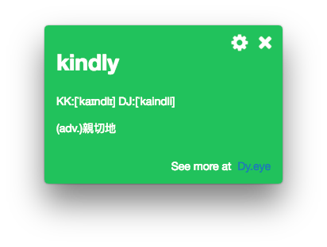
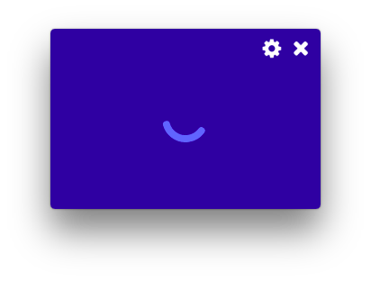

# Word Card

This application will pin the top on the screen and show an English word and Chinese explanation correspondingly. 

This project is built on the [electron](http://electron.atom.io).

## How to build the project?
### Run on local device
`$ npm install`

`$ npm run`

### Build for Mac
`$ npm run build_mac`

### Build for Windows
`$ npm run build_windows`

## Release note
### 0.1.1.170227
New

1. Show the phonetic. (source: Dy.eye)
2. Add the transitions view (progress view).

### 0.1.0.170218
First version. Provide the simplest word card.

1. Embed dictionary.
2. Constant time (5 mins) to switch the English word.

## Reference
* Dictionary source: [https://github.com/schrbjvc0127/EnglishGame](https://github.com/schrbjvc0127/EnglishGame)
* Phonetic source: [Dy.eye](http://yun.dreye.com/)